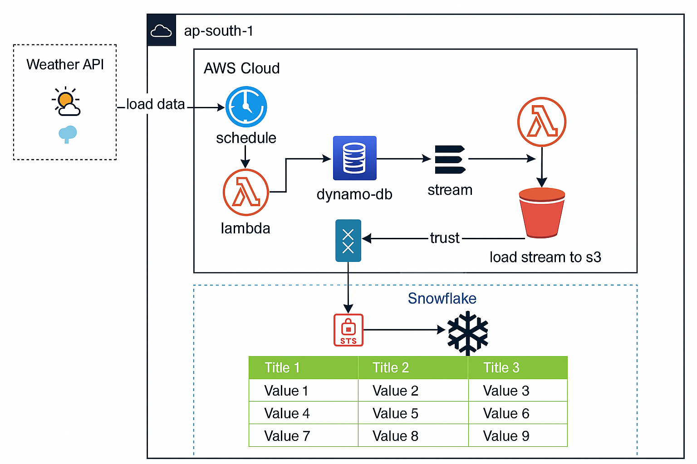

# 🌦️ Weather Data Pipeline with AWS & Snowflake

This project is a serverless data pipeline that ingests weather data from a public API and processes it using AWS services (Lambda, DynamoDB, S3) before loading it into Snowflake for analytics and reporting.

---

## 🔧 Architecture Overview



---

## 🚀 Features

- ⏰ **Automated ingestion**: Weather data fetched on a schedule using AWS Lambda.
- 🧱 **Raw data storage**: Stored in DynamoDB with streaming enabled.
- 📦 **Stream to S3**: Real-time Lambda stream handler processes and uploads data to S3.
- ❄️ **Snowflake integration**: S3 bucket is mounted in Snowflake as an external stage for querying.
- 🔒 **Secure IAM roles and trust policies**

---

## 🛠️ Tech Stack

- **AWS Lambda** – Serverless compute
- **DynamoDB** – NoSQL storage for raw weather data
- **S3** – Data lake storage for processed streams
- **Snowflake** – Scalable cloud data warehouse
- **Python + Boto3** – Scripting and AWS SDK
- **CloudWatch** – Monitoring and logging

---

## 📁 Folder Structure

weather-pipeline/
│
├── lambda_ingestor/ # Fetches weather data from API
│ └── handler.py
│
├── lambda_stream_to_s3/ # Processes DynamoDB stream and stores in S3
│ └── handler.py
│
├── utils/ # Helper utilities
│ └── s3_utils.py
│
├── snowflake/ # Snowflake SQL scripts
│ └── create_stage.sql
│
├── diagram/ # Architecture diagram
│ └── weather_pipeline_diagram.png
│
└── README.md # This file


---

## 📊 Sample Output (Snowflake Table)

| City      | Temp (°C) | Condition  | Timestamp           |
|-----------|-----------|------------|---------------------|
| Lahore    | 32.5      | Clear Sky  | 2025-05-30 08:00:00 |
| Karachi   | 29.0      | Humid      | 2025-05-30 08:00:00 |

---

## 🚀 Setup Instructions

1. Clone the repository:
    ```bash
    git clone https://github.com/zainalvi110/WeatherData-AWS-Snowflake-DataPipeline.git
    ```

2. Install dependencies:
    ```bash
    pip install boto3 requests
    ```

3. Deploy the Lambda functions using AWS Console or SAM/Serverless Framework.

4. Set up Snowflake external stage and define your table using provided SQL.

---

## 🧠 Author

**Zain Alvi**  
[LinkedIn](https://www.linkedin.com/in/yourprofile)  
[Portfolio](https://yourportfolio.com)

---

## 📄 License

This project is licensed under the MIT License - see the [LICENSE](LICENSE) file for details.


